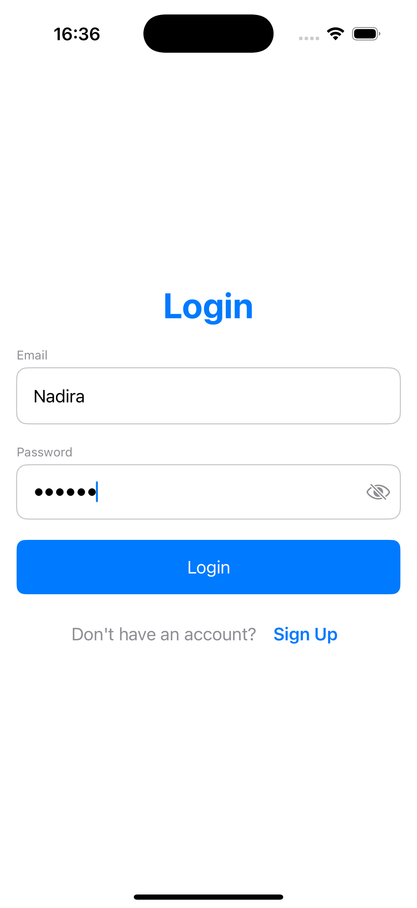
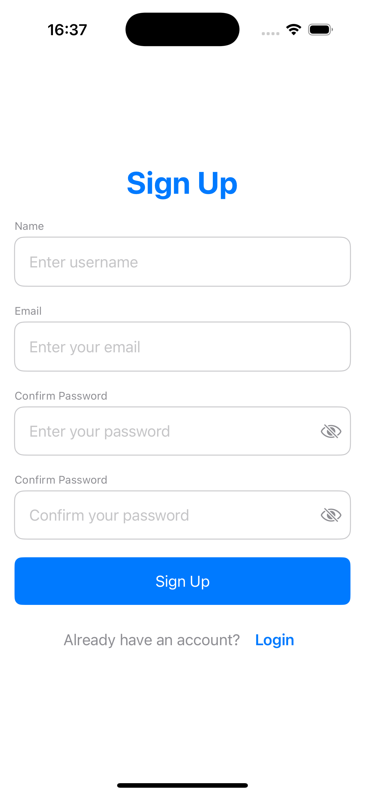
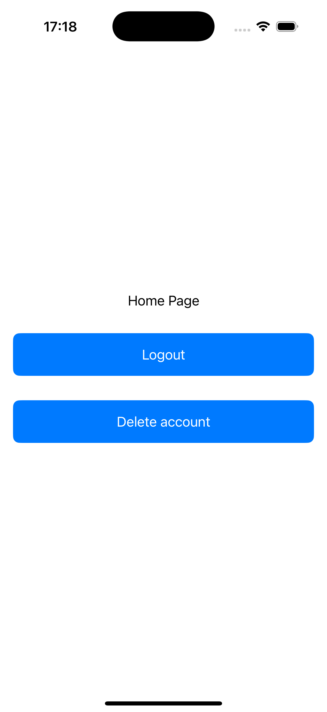

# 🔐 SwiftUI Authentication App

This is a simple authentication demo app built with **SwiftUI**.  
The app demonstrates a basic local authentication flow using `UserDefaults` for session and user data storage.

The project reuses the same UI screens and focuses on implementing authentication and session logic.

---

## ✨ Features

- Splash screen with automatic navigation
- Login and Sign Up flow
- Local user registration
- Local login authentication
- Session persistence using UserDefaults
- Auto-login if user session exists
- Logout and delete user functionality
- User-friendly validation and error alerts

---

## 🖼 Screenshots

  
  
  
  

---

## 🔄 App Flow

### App Launch

- On app launch, the Splash Screen is shown
- The app checks for an existing user session
- If the user is already logged in, the app navigates directly to the Home Screen
- If no active session is found, the app navigates to the Login Screen after the splash timer

---

## 📝 User Registration (Sign Up)

- Users can create an account using the Sign Up screen
- The app saves the following data locally using UserDefaults:
  - Email
  - Password
  - Login session flag
- If the email already exists, registration is not allowed
- After successful registration, the user is automatically logged in and redirected to the Home Screen

---

## 🔑 Login

- Users can log in using their registered email and password
- The app validates that fields are not empty
- The app checks saved credentials from UserDefaults
- Login results:
  - If the user does not exist, an alert is shown
  - If credentials are incorrect, an alert is shown
  - If credentials are correct, the user session is saved and the user is navigated to the Home Screen

---

## 🏠 Home Screen

- The Home Screen provides:
  - Logout button
  - Delete User button

### Logout

- Logs out the current user
- Clears the session flag
- Keeps saved user credentials
- Navigates back to the Login Screen

### Delete User

- Deletes all locally saved user data:
  - Email
  - Password
  - Session flag
- After deletion, the user is redirected to the Login Screen
- The user cannot log in again with deleted credentials

---

## 💾 Data Persistence

- User data and session state are stored using `UserDefaults`
- This implementation is intended for MVP/demo purposes only

---

## 🛠 Tech Stack

- Swift
- SwiftUI
- UserDefaults
- NavigationStack

---

## 👩‍💻 Author

Nadira Seitkazy  
Junior iOS Developer

